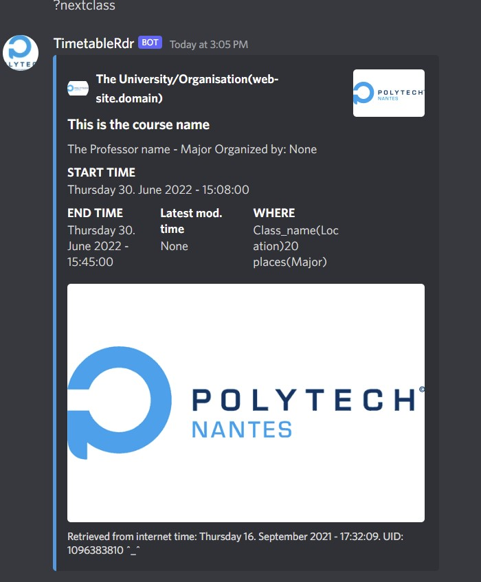
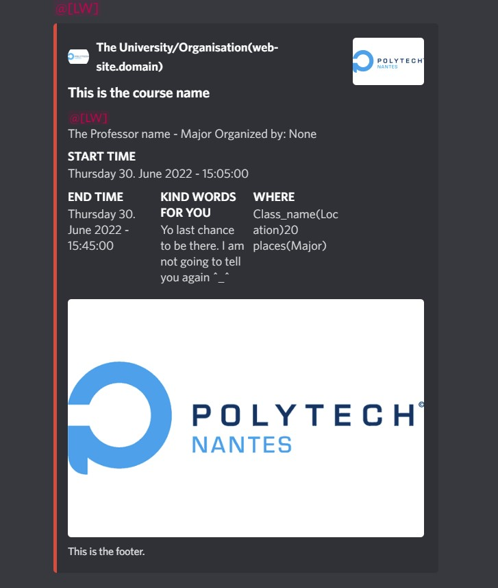

# TimeTableRdr_bot
Reads the time table from ical and send notifications whenever a class is about to start into a specific channel of a discord server.

## Dependencies
```python
discord [multidict, attrs, asynctimeout, yarl, aiohttp, discord.py]
ics [python-dateutil, arrow, tatsu]
pytz
discord_buttons_plugin
```

### Commands
```rust
"?nextclass   => {
      Return an embed reply showing the next class.
      shows the class name, starting date and time
      location of the course, the last modification date of the ics file
      ...
 }
 
 "?mynotif   => {
      Settings panel to set your notification preferences with button.
      Notification = [
                        "No Notif"  -> No notification, 
                        "LW",       -> Last Warning notification
                        "QH",       -> Notification 15 mins before
                        "HH",       -> Notification 1/2 hour before
                        "1H"        -> Notification 1 hour before
                     ]
      
      ...
 }
"?roles"  Display all the roles available in the server
"?setnotifchannel To specify a channel for notifications notification. (Not a typo)
"?display" Shows an embed response, can be set to whatever, multiple field name
"?ping"   does what the name says
"?hey"    => "Hello :) !"
"?tired"  => "Sounds like a YOU problem >_>"
"?nice"   => For something nice

"?sup"    => For simple Human/Bot conversation/interraction.

Unknown command?
Read commands with prefix "?", undefined command gets "what did you say to me" as a response

more information: "?help"
```

### Examples




### Want to try it?
- Discord server with channel: {timetablerdr, timetable}, of course, can be changed in the source files
- Create a DiscordBot from [https://discord.com/developers/applications](url), copy the token and put it in `main.py` `client.run` function.
- Get a valid ics file or link, edit `timetableMod.py` : url ='the url'
- Set the desired pictures to be displayed in the embed notification: edit 

`
thumbnail, image, icon and author variable accordingly
`


The bot presence is idle by default, again, can be modified for `online`, along with the `activity aka Game` _playing something_.
